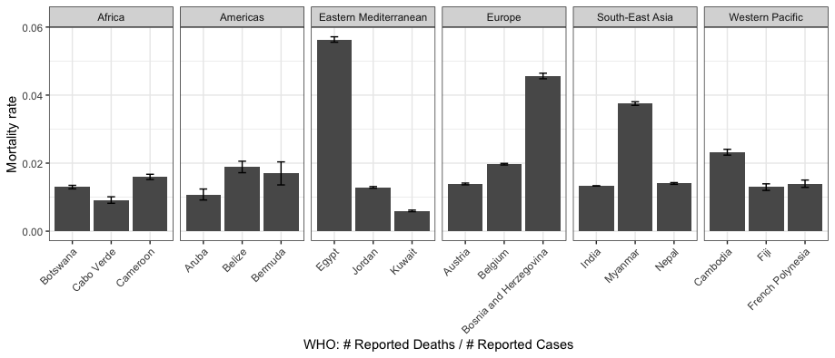

```{r setup, include=FALSE}
knitr::opts_chunk$set(echo = TRUE)
library(knitr)
```

## Group Homework 

- You will work with your group to complete this assignment.

- Upload your `html` file on [RPubs](https://rpubs.com) and include the link when you submit your submission files on Collab. 

- Submit your group's shared `.Rmd` AND "knitted"`.html` files on Collab.

- Note that this `html` file is now uploaded on [RPubs](https://rpubs.com/DS3003/A11).

## Group Homework

- Your "knitted .html" submission must be created from your "group .Rmd" but be created on your own computer.
    
- Confirm this with the following comment included in your submission text box: **"Honor Pledge: I have recreated my group submission using using the tools I have installed on my own computer"**
    
- Name the files with a group name and YOUR name for your submission.

- *Each group member must be able to submit this assignment as created from their own computer. If only some members of the group submit the required files, those group members must additionally provide a supplemental explanation along with their submission as to why other students in their group have not completed this assignment.*

# Part 1 

## Part 1: Instruction 

- Use the `EuStockMarkets` data that contains the daily closing prices of major European stock indices: Germany DAX (Ibis), Switzerland SMI, France CAC, and UK FTSE. Then, create multiple lines that show changes of each index's daily closing prices over time.

- Please use function `gather` from package `tidyr` to transform the data from a wide to a long format. For more info, refer to our lecture materials on dataformats (i.e., `DS3003_dataformat_facets_note.pdf`, `DS3003_dataformat_facets_code.rmd`, or `DS3003_dataformat_facets_code.html`

- Use function `plot_ly` from package `plotly` to create a line plot. 

## Part 1: Example 

- see the `html` file.


##  Part 1: Results

```{r, message=FALSE}
library(tidyr) # load tidyr package
library(plotly) # load plotly package

data(EuStockMarkets) # load EuStockMarkets
dat <- as.data.frame(EuStockMarkets) # coerce it to a data frame
dat$time <- time(EuStockMarkets) # add `time` variable

dat$time = as.numeric(dat$time)

long_dat <- gather(dat,
                  key = index_att,
                  value = measurement, 
                  DAX:FTSE)
#View(long_dat)

plot_ly(long_dat,
        x = ~time,
        y = ~measurement,
        color = ~index_att,
        type = 'scatter',
        mode = 'lines')
```

# Part 2

## Part 2: Instruction 

- Use the SCS Data set you downloaded from the previous group assignments, and then investigate the relationship between the mathematics achievement score (“mathpre”) and the math anxiety score (“mars”).

- Plot the data, linear line, and **bootstrap confidence envelopes**. Use 2,000 bootstrap replicates (i.e., R=2000) in function `boot`, and add appropriate x- and y- labels, and a title to the graph.

- Please refer to *section: Linear regression with bootstrap confidence intervals* in `DS3003_visualizingerrors_reg_note.html` and `DS3003_visualizingerrors_reg_code.html`.

```{r}
library(foreign)
SCS = read.spss("./SCS_QE.sav", to.data.frame = TRUE)

incex = SCS[, c("mathpre", "mars")]

b.stat <- function(data, i)
{
   b.dat <- data[i ,]
   out.lm <- lm(mathpre ~ mars, b.dat)
   predict(out.lm, data.frame(mars=incex2$mars))   
}

incex2 <- incex[1:100,]

b.out <- boot(incex2, b.stat, R = 2000) # R = num of replications

boot.ci(b.out, index = 1, type = 'perc') # 95% CI for the first observation

b.ci <- t(sapply(1:nrow(incex2), function(x) boot.ci(b.out, index = x, type = 'perc')$percent))[, 4:5]
dimnames(b.ci) <- list(rownames(incex2), c('lower', 'upper'))

incex4 <- cbind(incex2, b.ci) # combine two datasets
ggplot(incex4, aes(x=mars, y=mathpre)) + geom_point(alpha=0.2) + labs(x = 'Math Anxiety Score', y = 'Math Achievement Score', title = "Relationship Between Math Anxiety and Math Achievement Scores") + theme_bw() + 
        geom_smooth(method='lm', formula= y~x, se = FALSE) +
        geom_ribbon(aes(ymin = lower, ymax = upper), alpha = 0.3, fill="#69b3a2")

```

# Part 3

## Part 3: Instruction 

- Create WHO Reporting Barplots **with error bars** separated by `WHO region` using either `facet_grid` or `facet_wrap`.

- First, get the latest data from from [https://covid19.who.int/table](https://covid19.who.int/table).
      
   - The file should likely be named "WHO COVID-19 global table data March XXth 2022 at XXXXX.csv"
       
   - Don't use the data that I uploaded on Collab. It's not the most recent data. 


## Part 3: Instruction (Cont'd)

- Second, create a subset including 3 countries per `WHO region` (Africa, Americas, Eastern Mediterranean, Europe, South-East Asia, Western Pacific). You can choose any three countries within each `WHO region` to compare the mortality rate (`mutate(rate = "Deaths - cumulative total"/"Cases - cumulative total")`). 

- Third, draw bar plots with error bars using your subset, but adjust the graph in the facets using either `facet_grid` or `facet_wrap` (e.g., `facet_grid(~ "WHO region", scale="free")`. Please include `scale="free"` in your `facet` function.

```{r}
library(ggplot2)
library(dplyr)
```

```{r}
covid <- read.csv('WHO-COVID-19.csv')
cat('Dimensions: ', dim(covid))
names(covid) = c('Country', 'WHO_Region', 'CumulativeCases', 'CCper1000', 'CC_Last7', 'CC_Last7_per1000', 'CC_Last24hr',
                   'CumulativeDeaths', 'CDper1000', 'CD_Last7', 'CD_Last7_per1000', 'CD_Last24hr')
head(covid)
```

```{r}
Countries = c(
  'Botswana', 'Cabo Verde', 'Cameroon',
  'Aruba', 'Belize', 'Bermuda',
  'Egypt', 'Jordan', 'Kuwait',
  'Austria', 'Belgium', 'Bosnia and Herzegovina',
  'India', 'Myanmar', 'Nepal',
  'Cambodia', 'Fiji', 'French Polynesia'
)
```

```{r}
covid_2 %>% 
  filter(Country %in% Countries) %>% 
  mutate(
    rate=(CumulativeDeaths) / (CumulativeCases),
    SE=sqrt(rate*(1-rate)/CumulativeCases)
  ) %>% 
  ggplot(
    aes(
      x=Country, 
      y=rate
    )
  ) + 
  geom_col() +
  theme_bw() + 
  theme(
    axis.text.x=element_text(
      angle=90,
      hjust=0.95,
      vjust=0.20
    )
  ) + 
  xlab('WHO: # Reported Deaths / # Reported Cases') + 
  ylab('Mortality Rate') + 
  geom_errorbar(
    aes(
      ymin=rate-1.96*SE, 
      ymax=rate+1.96*SE
    ), 
    width=0.25
  ) + 
  facet_grid(~WHO_Region, scale="free")
```


## Part 3: Example

```{r, echo=FALSE, out.width="100%"}

```


- One of the group members will **present R codes and plots** for Part 3 in class on **Mar. 21 (Mon)**.  Also, if you're a presenter, please bring your laptop so that you can share your screen on zoom for the presentation.

