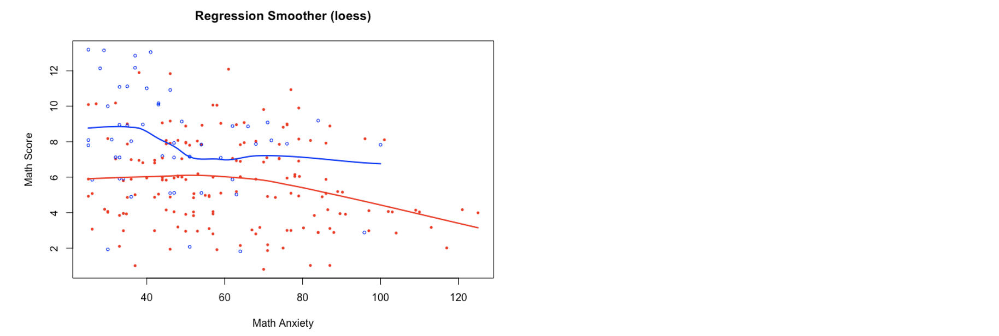
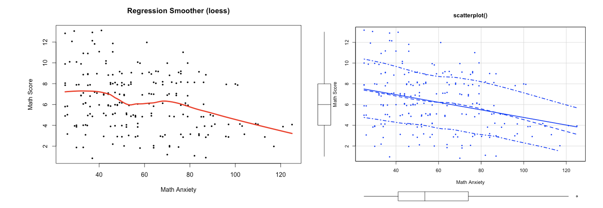

```{=html}
<style>
h1.title {
  font-size: 30px;
}
h1 {
  font-size: 26px;
}
h2 {
  font-size: 22px;
}
h3 { 
  font-size: 18px;
}

</style>
```

# Group Homework 

- You will work with your group to complete this assignment.

- *Submit your group's shared `.Rmd` AND "knitted"`.html` files*
    
    +  Your "knitted .html" submission must be created from your "group .Rmd" but be created on your own computer
    
    + Confirm this with the following comment included in your submission text box: **"Honor Pledge: I have recreated my group submission using using the tools I have installed on my own computer"**
    
    + Name the files with a group name and YOUR name for your submission

*Each group member must be able to submit this assignment as created from their own computer. If only some members of the group submit the required files, those group members must additionally provide a supplemental explanation along with their submission as to why other students in their group have not completed this assignment.*


# Part 1 

- Use the SCS Data set you downloaded from Collab for Assignments 4 and 5, and then investigate the relationship between the mathematics achievement score (“mathpre”) and the math anxiety score (“mars”) by plotting the data and the path of means. 

- Don't use package `ggplot2` for Part 1. Use `ggplot2` for Part 2.

**(1) Produce a scatterplot between “mathpre” and “mars” (you might consider using `jitter()` or `alpha()` for avoiding overlying points) and add a regression smoother using `loess()`. Compare the resulting plot to the plot you obtain by using `scatterplot()` from the `car`-package.**

```{r}
library(foreign)
SCS = read.spss("./SCS_QE.sav", to.data.frame = TRUE)
```


```{r}
# Scatterplot
plot(
  mathpre ~ jitter(mars),
  data=SCS,
  cex=0.3,
  xlab="Math Anxiety Score",
  ylab="Math Achievements Score",
  main="Regression Smoother (loess)"
)
# X-value Sequence
x.val <- seq(0, max(SCS$mars), by = .5)

# ------ LOcal regrESSion ------
out.lss <- loess(
  mathpre ~ mars, 
  data=SCS,
  span=.4, 
  degree=0
)
# Get Predicted Values
y.pred <- predict(
  out.lss, 
  data.frame(mars=x.val)
)  
# Plot Predicted Values
lines(
  x.val, 
  y.pred, 
  col='red',
  lwd=3
)
```

```{r eval=FALSE, include=FALSE}
# TODO -- install car... scatterplot()

install.packages("car")
library(car)

scatterplot(
  
  
  main="scatterplot()"
)
# X-value Sequence
x.val <- seq(0, max(SCS$mathpre), by = .5)

# ------ LOcal regrESSion ------
out.lss <- loess(
  mars ~ mathpre, 
  data=SCS,
  span=.2, 
  degree=0
)
# Get Predicted Values
y.pred <- predict(
  out.lss, 
  data.frame(mathpre=x.val)
)  
# Plot Predicted Values
lines(
  x.val, 
  y.pred, 
  col='red',
  lwd=2
)
```


**(2) Draw separate regression smoothers for female and male students (variable “male”). Use `loess()`.**

```{r}
colors <- c("red", "blue")
```


```{r}
# Scatterplot
plot(
  mathpre ~ jitter(mars),
  data=SCS,
  cex=0.3,
  xlab="Math Anxiety Score",
  ylab="Math Achievements Score",
  main="Regression Smoother (loess); by gender",
  col=colors[factor(male)]
)
# X-value Sequence
x.val <- seq(0, max(SCS$mars), by = .5)

# ------ LOcal regrESSion ------
# Estimate model for males
out.m <- loess(
  mathpre ~ mars, 
  data=SCS,
  subset=male=="male",
  span=.75, 
  degree=0
) 
# Estimate model for females
out.f <- loess(
  mathpre ~ mars, 
  data=SCS,
  subset=male=="female",
  span=.75, 
  degree=0
) 
# Get and Plot Predicted Values
lines(
  x.val, 
  predict(out.m, x.val), 
  col='blue', 
  lwd=2
)
lines(
  x.val, 
  predict(out.f, x.val), 
  col='red', 
  lwd=2
)
```


**(3) Describe the roles of regression smoothers in finding a relationship between math scores and math anxiety.**  

Regression smoothers help to reduce some of the noise in a scatterplot in order to make a relationship more apparent. In this example, the initial scatterplot makes the relationship between math scores and math anxiety relatively unclear. Yet, adding the loess regression smoother makes it apparent that there is a negative, linear relationship between math scores and math anxiety. In other words, math scores typically decrease as math anxiety increses (and vice versa).


For (1), you should produce plots similar to the following ones [‘play’ with the `span` argument in `loess()`]: 



For (2), you should produce a plot similar to the following one:




# Part 2

- Re-do **Part 1** using package `ggplot2`. That is, 

(1) Produce a scatterplot (you might consider using `geom_jitter()` or the argument `alpha` from package `ggplot2` for avoiding overlying points) and add a regression smoother using `geom_smooth()`. 

```{r}
library(ggplot2)

ggplot(SCS, aes(x=mars, y=mathpre)) + 
  geom_point(alpha=0.75) + 
  labs(
    x='Math Anxiety Score', 
    y='Math Achievements Score',
    title='ggplot2 Regression Smoother (loess)'
  ) +
  geom_smooth(
    method='loess', 
    formula=y~x, 
    col="red", 
    se=FALSE
  ) +
  theme(
    plot.title=element_text(hjust = 0.5)
  )
```

(2) Draw separate regression smoothers for female and male students (variable “male”). Use package `ggplot2`.

```{r}
ggplot(SCS, aes(x=mars, y=mathpre, col=male)) + 
  geom_point(alpha=0.75) + 
  labs(
    x='Math Anxiety Score', 
    y='Math Achievements Score',
    title='ggplot2 Regression Smoother (loess)'
  ) +
  geom_smooth(
    method='loess', 
    formula=y~x, 
    se=FALSE
  ) +
  theme(
    plot.title=element_text(hjust = 0.5)
  )
```


# Part 3

- Use a dataset in data repositories (e.g., [kaggle](https://www.kaggle.com/datasets)) that gives the measurements in different conditions like `iris` data. For more info on `iris` data, use `?iris`.

- Briefly describe the dataset you're using for this assignment (e.g., means to access data, context, sample, variables, etc...).

Our data set is sourced from [Kaggle](); specifically, here is the [link](https://www.kaggle.com/parulpandey/palmer-archipelago-antarctica-penguin-data) to our dataset. Per the Kaggle description, the data was collected and made available by Dr. Kristen Gorman and the Palmer Station, Antarctica LTER, a member of the Long Term Ecological Research Network.  

The dataset is very similar to the iris dataset, such that contains various measurement variables that are aimed to classify Palmer Archipelago penguin species: Chinstrap, Adélie, or Gentoo. It includes the following variables:  
* species: penguin species
* culmen_length_mm: culmen length (mm)
* culmen_depth_mm: culmen depth (mm)
* flipper_length_mm: flipper length (mm)
* body_mass_g: body mass (g)
* island: island name
* sex: penguin sex  

```{r}
penguins <- read.csv('penguins.csv')
dim(penguins)
```

Here are the first five rows of the dataset:
```{r}
head(penguins)
```
   
- Transform the dataset from a wide to a long format. Produce any ggplot where the key variable is used in function `facet_grid` or `facet_wrap`.

```{r}
library(tidyr)

long_penguins <- gather(
  penguins[, c(1, 3:5)], 
  key=penguin_att,
  value=measurement,
  culmen_length_mm:flipper_length_mm
)
head(long_penguins)
```

```{r}
ggplot(long_penguins, aes(x=species, y=measurement)) + 
  geom_boxplot() + 
  facet_grid(~penguin_att) + 
  theme_bw()
```
